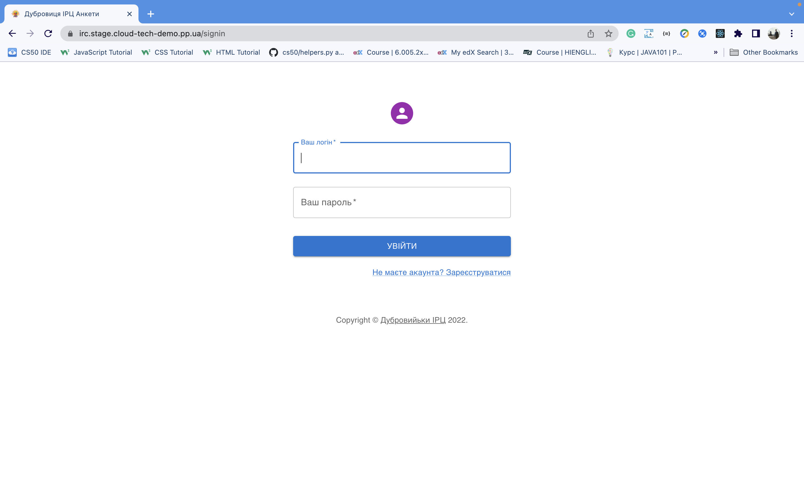
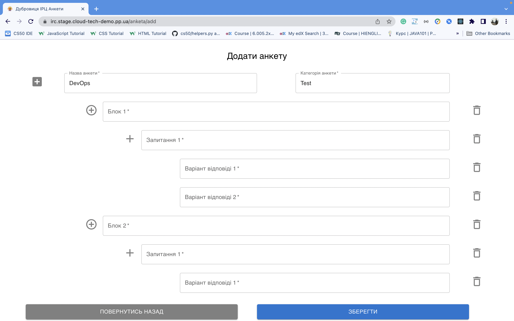
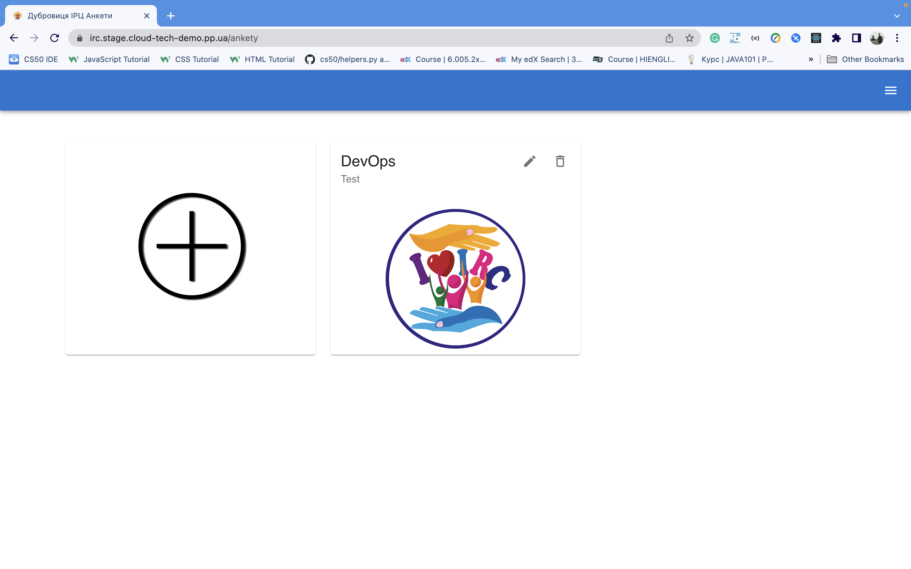
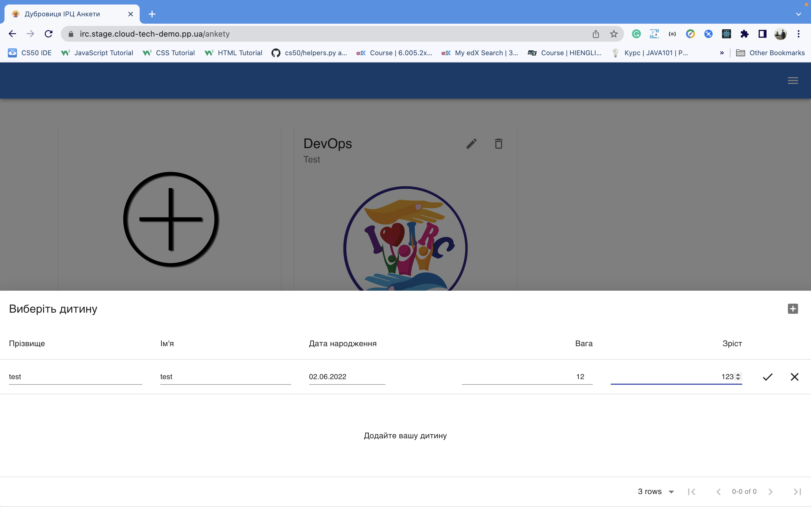
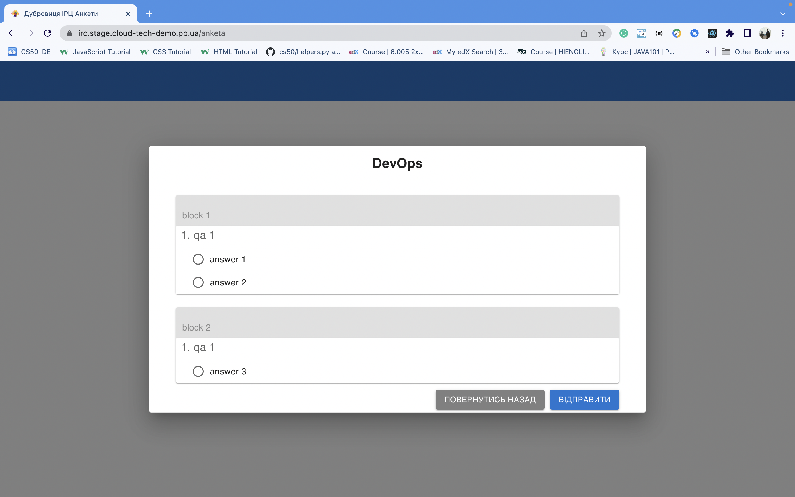
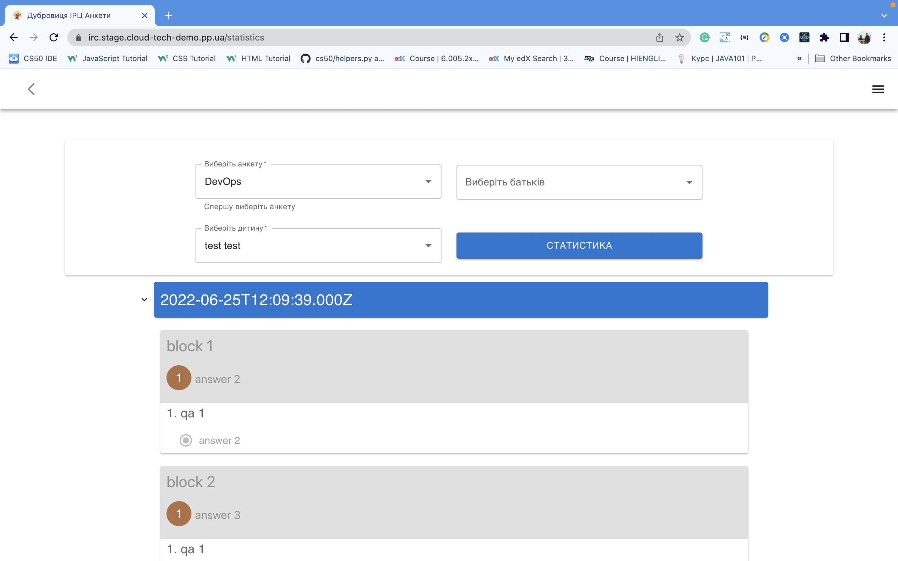

# cloud-tech-demo
## This application is deployed on mixed EKS Cluster that use Fargate and EC2 instances.

## Screenshots of application








### Useful commands

Update kubeconfig
```
aws eks --region us-east-1  --profile cloud-tech update-kubeconfig --name cloud-tech-demo
```

Remove unused docker volumes on (jenkins) EC2 instance
```
docker volume rm $(docker volume ls -qf dangling=true)
```

DNS: https://nic.ua/en/login 
